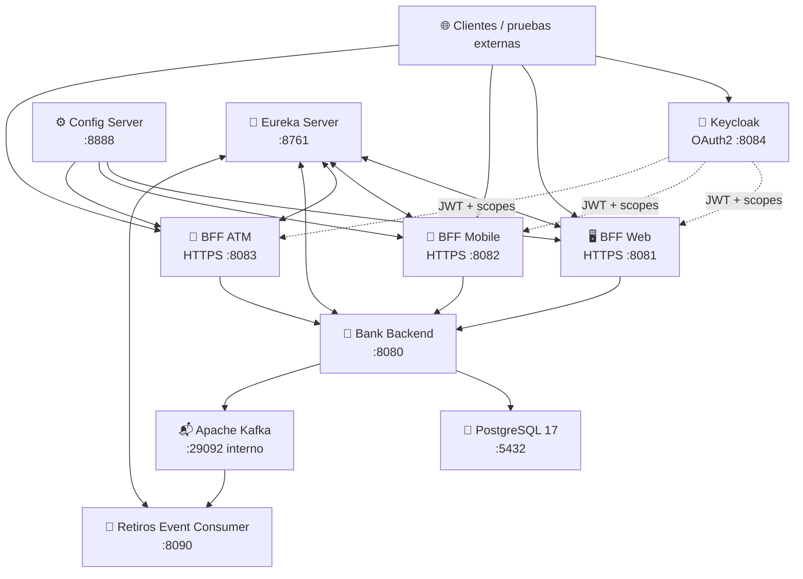
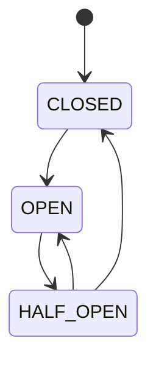
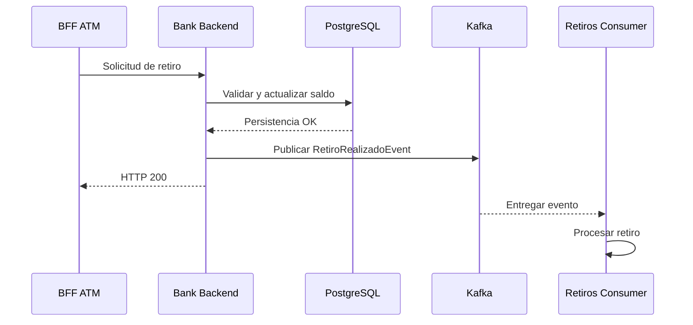
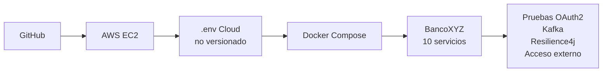

# 🏦 Propuesta Técnica — BancoXYZ

> **Microservicios resilientes, seguridad OAuth2 y arquitectura orientada a eventos**
> **Desarrollo Backend III (PBY2203) · Semana 8 · Grupo 13**

---

## 1. Propósito

La propuesta técnica de **BancoXYZ Semana 8** consolida una arquitectura distribuida orientada a microservicios, incorporando seguridad OAuth2, resiliencia, mensajería asíncrona, contenerización y despliegue Cloud.

La implementación evoluciona sobre la base estable desarrollada en semanas anteriores y mantiene como principios principales:

- separación de responsabilidades;
- desacoplamiento entre canales;
- configuración centralizada;
- descubrimiento dinámico de servicios;
- protección ante fallos;
- procesamiento asíncrono de eventos;
- externalización de secretos;
- reproducibilidad local y Cloud.

La solución fue finalmente **desplegada y validada en AWS EC2**, además de contar con validación local previa.

---

## 2. Objetivos técnicos

Los objetivos de la etapa son:

1. proteger los BFF mediante OAuth2.0 y JWT;
2. mantener contratos separados para Web, Mobile y ATM;
3. evitar dependencias rígidas de IP entre microservicios;
4. centralizar configuración operativa;
5. aplicar tolerancia a fallos con Resilience4j;
6. desacoplar el procesamiento posterior de retiros mediante Kafka;
7. separar productor y consumidor Kafka en microservicios distintos;
8. contenerizar todos los componentes;
9. orquestar el ecosistema mediante Docker Compose;
10. mantener secretos fuera del código fuente;
11. restringir la exposición de infraestructura interna;
12. desplegar y validar la solución completa en AWS EC2.

### 2.1 Cumplimiento explícito del criterio OAuth2

El componente de seguridad **OAuth2 no queda propuesto como trabajo futuro**. Forma parte de la implementación final de Semana 8 y fue validado funcionalmente en AWS EC2.

```text
Keycloak realm: bancoxyz

bff-web-client     → scope bancoxyz.web     → HTTP 200
bff-mobile-client  → scope bancoxyz.mobile  → HTTP 200
bff-atm-client     → scope bancoxyz.atm     → HTTP 200

Sin autenticación / token inválido      → HTTP 401
Token válido con scope de otro canal    → HTTP 403
```

Cada BFF opera como **Spring Resource Server JWT** y valida firma, issuer y scope. Por tanto, el criterio de seguridad OAuth2 solicitado por la rúbrica se encuentra **incorporado, operativo y respaldado por evidencia reproducible**.

Las consideraciones posteriores sobre TLS, DNS, reverse proxy o `sslRequired` corresponden exclusivamente a **hardening productivo** de una implementación OAuth2 ya funcional.

---

## 3. Arquitectura final

BancoXYZ queda compuesto por **10 servicios**.



---

## 4. Componentes y responsabilidades

| Componente | Responsabilidad |
|---|---|
| PostgreSQL 17 | Persistencia de cuentas y estado bancario |
| Apache Kafka | Transporte asíncrono de eventos |
| Keycloak 26.8.0 | Autenticación OAuth2 y emisión de JWT |
| Config Server | Configuración centralizada |
| Eureka Discovery Server | Registro y descubrimiento |
| Bank Backend | Lógica bancaria, persistencia y producción Kafka |
| BFF Web | Contrato optimizado para canal Web |
| BFF Mobile | Contrato reducido para canal Mobile |
| BFF ATM | Operaciones específicas del cajero |
| Retiros Event Consumer | Procesamiento asíncrono independiente |

La separación evita concentrar seguridad, lógica, persistencia y procesamiento de eventos dentro de un único servicio.

---

## 5. Diseño de seguridad OAuth2

### 5.1 Proveedor de identidad

Se utiliza **Keycloak 26.8.0**.

Realm:

```text
bancoxyz
```

Clientes:

```text
bff-web-client
bff-mobile-client
bff-atm-client
```

Scopes:

```text
bancoxyz.web
bancoxyz.mobile
bancoxyz.atm
```

### 5.2 Flujo

Se utiliza `client_credentials`, adecuado para comunicación máquina a máquina dentro del escenario académico.

Cada BFF actúa como **Spring Resource Server JWT**.

```text
Cliente OAuth2
     │
     ▼
Keycloak
     │ access_token
     ▼
BFF correspondiente
     │
     ├── valida firma JWT
     ├── valida issuer
     └── valida scope
```

### 5.3 Resultado validado

```text
Token + scope correctos  → HTTP 200
Token ausente/incorrecto → HTTP 401
Scope incorrecto         → HTTP 403
```

En AWS EC2 se validaron los tres clientes y los tres escenarios.

---

## 6. Separación entre issuer público y token endpoint interno

Durante la validación Cloud se detectó una diferencia operacional importante.

El issuer de los JWT debe permanecer estable y accesible externamente:

```text
OAUTH2_ISSUER_URI=http://<ELASTIC_IP>:8084/realms/bancoxyz
```

Sin embargo, los scripts ejecutados dentro de la propia EC2 no necesitan volver a entrar por la Elastic IP. Para ellos se utiliza:

```text
OAUTH2_TOKEN_URL=http://127.0.0.1:8084/realms/bancoxyz/protocol/openid-connect/token
```

La separación evita dependencias innecesarias del Security Group y mantiene el issuer público correcto para la validación JWT.

---

## 7. Política SSL de Keycloak en laboratorio

Keycloak utiliza por defecto requisitos SSL para solicitudes externas.

Durante la prueba desde Internet se observó:

```text
HTTP 403
{"error":"invalid_request","error_description":"HTTPS required"}
```

Para el escenario académico se configuró el realm con:

```json
"sslRequired": "none"
```

Tras el ajuste, el endpoint OIDC público respondió:

```text
HTTP 200
```

### Decisión

Esta configuración se acepta **únicamente para laboratorio académico**.

En producción se recomienda:

```text
DNS
  ↓
Reverse Proxy / Load Balancer
  ↓
TLS válido
  ↓
Keycloak con SSL requerido
```

---

## 8. Externalización de secretos

Los secretos se mantienen fuera del código fuente.

Variables sensibles principales:

```text
POSTGRES_PASSWORD
KEYCLOAK_ADMIN_PASSWORD
OAUTH2_WEB_CLIENT_SECRET
OAUTH2_MOBILE_CLIENT_SECRET
OAUTH2_ATM_CLIENT_SECRET
SSL_KEYSTORE_PASSWORD
```

Variables operacionales relevantes:

```text
KEYCLOAK_PUBLIC_URL
OAUTH2_ISSUER_URI
OAUTH2_TOKEN_URL
DB_URL
```

El archivo `.env`:

- no se versiona;
- utiliza permisos restrictivos;
- contiene secretos distintos en Cloud;
- no forma parte de las imágenes Docker.

`.env.example` conserva sólo estructura y placeholders seguros.

---

## 9. Backend for Frontend

Los tres BFF separan los contratos según el consumidor.

### Web

```text
HTTPS :8081

GET /api/web/cuentas
GET /api/web/cuentas/{id}
GET /api/web/cuentas/{id}/detalle
```

### Mobile

```text
HTTPS :8082

GET /api/mobile/cuentas
GET /api/mobile/cuentas/{id}/resumen
```

### ATM

```text
HTTPS :8083

GET  /api/atm/cuentas/{id}/saldo
POST /api/atm/cuentas/{id}/retiro
```

Esta decisión evita publicar un contrato único sobredimensionado y permite aplicar reglas específicas por canal.

---

## 10. Configuración centralizada

Config Server se ejecuta en:

```text
8888
```

Archivos principales:

```text
Semana 8/config-repo/
├── bff-web.properties
├── bff-mobile.properties
└── bff-atm.properties
```

Centraliza:

- Eureka;
- backend lógico;
- timeouts;
- Circuit Breaker;
- Retry;
- Rate Limiter;
- Actuator.

Esto reduce duplicación y mantiene configuración operativa coherente.

---

## 11. Service Discovery

Eureka se ejecuta en:

```text
8761
```

Los BFF consumen el backend utilizando su nombre lógico:

```text
BANK-BACKEND
```

Spring Cloud LoadBalancer resuelve la instancia registrada.

La aplicación no necesita acoplarse a una IP física concreta del backend.

---

## 12. Resiliencia con Resilience4j

La comunicación BFF → Bank Backend utiliza:

- Circuit Breaker;
- Retry;
- Rate Limiter;
- Timeout;
- manejo controlado de errores.

### 12.1 Circuit Breaker

La prueba real en EC2 verificó:



Resultados observados:

```text
Operación normal ........ HTTP 200
Fallo 1 ................. HTTP 504 | ~9.49 s
Fallo 2 ................. HTTP 504 | ~9.44 s
Circuit Breaker ......... OPEN
Rechazo con OPEN ........ HTTP 503 | ~0.03 s
Eventos Retry ........... 6
Backend restaurado ...... healthy
Backend vía BFF ......... HTTP 200
Circuit Breaker final ... CLOSED
```

La transición comprobada fue:

```text
CLOSED → OPEN → HALF_OPEN → CLOSED
```

### 12.2 Retry

Se aplica únicamente a operaciones seguras.

El retiro ATM no utiliza Retry automático porque un reintento de una operación no idempotente podría duplicar el débito.

### 12.3 Rate Limiter

Controla ráfagas de solicitudes y devuelve `HTTP 429` al superar el límite configurado.

---

## 13. Arquitectura orientada a eventos

### 13.1 Decisión

El consumidor Kafka fue extraído de `bank-backend` y convertido en un microservicio independiente:

```text
retiros-event-consumer
```

De esta forma:

```text
Bank Backend            = productor
Retiros Event Consumer  = consumidor
```

Esto demuestra comunicación asíncrona real entre microservicios y permite escalar el procesamiento posterior de retiros de manera independiente.

### 13.2 Flujo funcional



### 13.3 Topic y Consumer Group

```text
Topic ............... bancoxyz.retiros
Consumer Group ...... bancoxyz-retiros-group
```

### 13.4 Evidencia EC2

```text
Saldo antes .......... 5050.0
Retiro ............... HTTP 200
Saldo después ........ 5049.0
Producer ............. EVENTO PUBLICADO
Consumer ............. EVENTO CONSUMIDO
Current Offset ....... 0 → 1
Log End Offset ....... 0 → 1
Lag .................. 0
```

---

## 14. Persistencia

PostgreSQL 17 mantiene el estado bancario.

Conexión interna:

```text
postgres:5432
```

Los scripts de esquema e inicialización se ubican en:

```text
Semana 8/database/
```

El volumen persistente permite recrear contenedores sin eliminar los datos.

---

## 15. Dockerización

Cada microservicio Java ejecutable dispone de Dockerfile.

Servicios construidos desde el proyecto:

- Config Server;
- Discovery Server;
- Bank Backend;
- BFF Web;
- BFF Mobile;
- BFF ATM;
- Retiros Event Consumer.

Imágenes externas:

- PostgreSQL 17;
- Apache Kafka;
- Keycloak 26.8.0.

Los Dockerfiles utilizan construcción multi-stage para separar compilación y runtime.

---

## 16. Docker Compose

`docker-compose.yml` coordina los **10 servicios**.

Incluye:

- red `bancoxyz-net`;
- healthchecks;
- `depends_on`;
- condiciones `service_healthy`;
- variables de entorno;
- volumen PostgreSQL;
- certificados y configuración;
- puertos públicos e internos.

Validación previa:

```bash
docker compose config >/dev/null
```

Resultado final en EC2:

```text
10/10 servicios operativos y healthy
```

---

## 17. Política de red

### Públicos y controlados

```text
8081  BFF Web
8082  BFF Mobile
8083  BFF ATM
8084  Keycloak
```

### Loopback del host

```text
8080  Bank Backend
8888  Config Server
8761  Eureka
9092  Kafka
5432  PostgreSQL
```

### Sólo red Docker

```text
8090  Retiros Event Consumer
```

Esto reduce la superficie expuesta sin impedir la comunicación interna.

---

## 18. Observabilidad

Spring Boot Actuator se utiliza para comprobar:

```text
/actuator/health
/actuator/info
/actuator/circuitbreakers
/actuator/circuitbreakerevents
/actuator/retries
/actuator/retryevents
/actuator/ratelimiters
/actuator/ratelimiterevents
```

Los healthchecks de Docker Compose se apoyan en endpoints de salud.

---

## 19. Despliegue Cloud en AWS EC2

La arquitectura fue desplegada en:

```text
AWS EC2
Ubuntu Server 26.04.1 LTS x86_64
t3.large
2 vCPU
8 GiB RAM
50 GiB gp3
Elastic IP
Docker Engine
Docker Compose Plugin
```

### Flujo de despliegue



Se utiliza sparse checkout para limitar el material desplegado a la raíz y `Semana 8`.

---

## 20. Hallazgos durante el despliegue Cloud

El despliegue real permitió detectar y corregir problemas de portabilidad que no se manifestaban en local.

### 20.1 Inicialización de Keycloak

El primer arranque requirió más tiempo por:

- inicialización del servidor;
- creación de esquema;
- importación del realm.

Una vez `healthy`, los BFF pudieron iniciarse sin reconstrucción completa.

### 20.2 Token endpoint desde EC2

El helper OAuth2 intentaba utilizar la Elastic IP desde la propia instancia.

Solución:

```text
Issuer público  → Elastic IP
Token helper    → 127.0.0.1
```

### 20.3 Ruta absoluta en script Resilience4j

Se detectó una ruta local hardcodeada:

```text
/home/natalia/...
```

La solución final resuelve dinámicamente `PROJECT_ROOT` desde la ubicación del repositorio, permitiendo utilizar el mismo script en CachyOS y Ubuntu EC2.

### 20.4 SSL requerido por Keycloak

El acceso OIDC externo devolvió inicialmente:

```text
HTTP 403 — HTTPS required
```

Para laboratorio académico:

```text
sslRequired = none
```

Luego el endpoint externo respondió `HTTP 200`.

---

## 21. Validación Cloud

### 21.1 Salud del stack

```text
10/10 servicios healthy
```

### 21.2 OAuth2

```text
WEB token WEB ............. HTTP 200
MOBILE token MOBILE ....... HTTP 200
ATM token ATM ............. HTTP 200

Sin token / inválido ...... HTTP 401
Scope incorrecto .......... HTTP 403
```

### 21.3 Kafka

```text
Producer .................. OK
Kafka ..................... OK
Consumer independiente .... OK
Offset .................... avanza
Lag ....................... 0
```

### 21.4 Resilience4j

```text
CLOSED → OPEN → HALF_OPEN → CLOSED
```

### 21.5 Acceso externo

```text
Keycloak OIDC ............. HTTP 200
BFF Web health ............ HTTP 200
BFF Mobile health ......... HTTP 200
BFF ATM health ............ HTTP 200

BFF sin token ............. HTTP 401
```

---

## 22. Organización del proyecto

```text
bancoxyzbatch/
├── .env.example
├── .gitignore
├── docker-compose.yml
├── pom.xml
├── README.md
├── Propuesta_Tecnica.md
└── Semana 8/
    ├── bank-backend/
    ├── bff/
    │   ├── bff-atm/
    │   ├── bff-mobile/
    │   └── bff-web/
    ├── config-repo/
    ├── config-server/
    ├── data/
    │   └── legacy/
    ├── database/
    ├── discovery-server/
    ├── docs/
    │   └── Documentacion_Capturas.pdf
    ├── keycloak/
    ├── retiros-event-consumer/
    └── scripts/
```

Artefactos sensibles o temporales no forman parte del repositorio.

---

## 23. Evidencia

La evidencia final se consolida en:

```text
Semana 8/docs/Documentacion_Capturas.pdf
```

Capturas Cloud principales:

```text
08_BANCOXYZ - HEALTHCHECK FINAL_EC2.png
09_PRUEBA_OAUT2_EC2_FINALIZADA.png
10_KAFKA_ENTRE_MICROSERVICIOS_EC2.png
11A_RESILIENCE4J_EC2_FINALIZADA.png
11B_RESILIENCE4J_EC2_FINALIZADA.png
12B_ACCESO_EXTERNO_ELASTIC_IP_EC2.png
```

---

## 24. Buenas prácticas

La solución aplica:

- responsabilidad única por servicio;
- BFF por consumidor;
- Config Server;
- Service Discovery;
- secretos externalizados;
- `.env` fuera de Git;
- Kafka entre microservicios separados;
- healthchecks;
- exposición mínima de red;
- scripts reproducibles;
- rutas portables;
- timeouts en pruebas de red;
- checkpoints estables;
- evidencia técnica trazable.

---

## 25. Trade-offs y consideraciones de producción

El proyecto corresponde a un entorno académico. **OAuth2 + Keycloak ya están implementados y validados**; lo siguiente corresponde a endurecimiento para producción, no a funcionalidad pendiente:

- DNS propio;
- reverse proxy o Load Balancer;
- TLS válido;
- restaurar requerimiento SSL de Keycloak;
- gestor de secretos;
- certificados gestionados;
- CI/CD;
- monitoreo centralizado;
- Kafka con múltiples réplicas;
- PostgreSQL administrado o replicado;
- backups y restauración probada;
- rotación de credenciales;
- alta disponibilidad;
- reglas de red más restrictivas.

La configuración `sslRequired: none` se considera exclusivamente una concesión de laboratorio para poder demostrar el flujo OAuth2 mediante una IP pública sin infraestructura TLS adicional.

---

## 26. Resultado técnico

BancoXYZ Semana 8 finaliza como una solución distribuida que integra:

```text
OAuth2 + JWT
      │
      ├── BFF Web
      ├── BFF Mobile
      └── BFF ATM
              │
              ▼
       Resilience4j
              │
              ▼
        Bank Backend
          │       │
          ▼       ▼
    PostgreSQL   Kafka
                   │
                   ▼
           Retiros Consumer
```

La arquitectura fue **construida, contenerizada, desplegada y validada en AWS EC2**.

Los criterios técnicos principales quedan demostrados con evidencia reproducible:

- OAuth2 funcional;
- Dockerfiles funcionales;
- Docker Compose completo;
- Resilience4j operativo;
- Kafka entre microservicios independientes;
- secretos externalizados;
- servicios internos protegidos;
- pruebas Cloud y externas verificadas.

---

**BancoXYZ · Grupo 13 · Desarrollo Backend III (PBY2203) · Semana 8**
