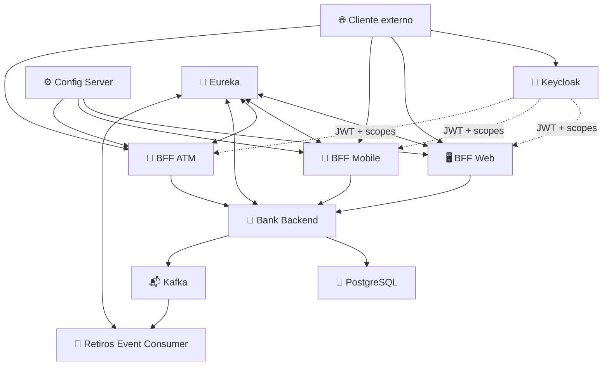

# 🏦 Propuesta Técnica — BancoXYZ

> **Microservicios resilientes, seguridad OAuth2 y arquitectura orientada a eventos**
> **Desarrollo Backend III (PBY2203) · Semana 8 · Entrega individual**
> **Autora: Natalia Alvarado**

---

## 1. Contexto y objetivo de la propuesta

BancoXYZ evoluciona el trabajo de semanas anteriores hacia una solución distribuida preparada para ejecutarse en un entorno Cloud. La propuesta busca resolver cinco necesidades técnicas centrales: **seguridad de acceso**, **portabilidad**, **orquestación**, **tolerancia a fallos** y **comunicación asíncrona entre microservicios**.

La solución final fue desplegada y validada en AWS EC2. El objetivo no fue únicamente lograr que los servicios iniciaran, sino demostrar que cada mecanismo exigido por la pauta funciona bajo condiciones reales de integración.

---

## 2. Principios de diseño

La arquitectura se construyó bajo los siguientes principios:

- separar responsabilidades por servicio;
- mantener contratos específicos para Web, Mobile y ATM;
- evitar acoplamiento directo a IPs internas;
- proteger cada canal mediante OAuth2 y scopes independientes;
- aislar fallos del backend mediante mecanismos de resiliencia;
- desacoplar tareas posteriores a una operación bancaria mediante eventos Kafka;
- externalizar secretos y configuración sensible;
- contenerizar todos los microservicios para asegurar portabilidad;
- limitar la exposición pública de componentes internos.

Estos principios permiten que la solución sea reproducible localmente y también desplegable en infraestructura Cloud sin modificar la lógica de negocio.

---

## 3. Arquitectura propuesta

La solución final utiliza **10 servicios orquestados con Docker Compose**, de los cuales **7 corresponden a microservicios Java construidos desde el proyecto**.



### Responsabilidades principales

| Componente | Responsabilidad |
|---|---|
| Keycloak | Autenticación OAuth2 y emisión de JWT |
| BFF Web | Contrato y autorización del canal Web |
| BFF Mobile | Contrato y autorización del canal Mobile |
| BFF ATM | Operaciones de cajero y autorización del canal ATM |
| Bank Backend | Lógica bancaria, persistencia y publicación de eventos |
| Retiros Event Consumer | Consumo asíncrono independiente de retiros |
| Config Server | Configuración centralizada |
| Eureka | Registro y descubrimiento de servicios |
| PostgreSQL | Persistencia bancaria |
| Kafka | Transporte asíncrono de eventos |

---

## 4. Decisiones técnicas y justificación

### 4.1 OAuth2 con Keycloak

Se eligió **Keycloak** como proveedor de identidad porque permite centralizar clientes, scopes, emisión de tokens y validación JWT sin incorporar autenticación propia dentro de cada BFF.

Se definieron tres clientes y tres scopes independientes:

```text
bff-web-client     → bancoxyz.web
bff-mobile-client  → bancoxyz.mobile
bff-atm-client     → bancoxyz.atm
```

Cada BFF funciona como **Spring Resource Server JWT** y exige el scope correspondiente a su canal. La decisión evita que un token válido para un consumidor pueda utilizarse indistintamente sobre otro.

El flujo fue validado en AWS EC2 con los resultados esperados:

```text
Token + scope correctos   → HTTP 200
Sin token / token inválido → HTTP 401
Scope de otro canal       → HTTP 403
```

Por tanto, OAuth2 forma parte de la solución implementada y no corresponde a una mejora futura. Las mejoras pendientes para producción se limitan al endurecimiento de transporte y operación, como TLS válido, DNS y gestión centralizada de secretos.

### 4.2 Backend for Frontend por canal

Se mantuvieron BFF separados para Web, Mobile y ATM. Esta decisión permite que cada consumidor exponga únicamente las operaciones y representaciones que necesita, además de asociar autorización y resiliencia de forma independiente.

La alternativa de un único gateway/BFF habría reducido el número de servicios, pero habría aumentado el acoplamiento entre canales y concentrado responsabilidades distintas en una sola aplicación.

### 4.3 Config Server y Eureka

Config Server centraliza propiedades operativas y Eureka evita que los BFF dependan de una dirección física del backend.

Los BFF consumen `BANK-BACKEND` mediante descubrimiento de servicios y Spring Cloud LoadBalancer. Esto mejora portabilidad y permite mover contenedores sin modificar código por cambios de IP.

### 4.4 Resilience4j

La comunicación síncrona BFF → Backend incorpora **Circuit Breaker, Retry y Rate Limiter**.

La estrategia separa tres problemas diferentes:

- **Circuit Breaker:** evita continuar golpeando un backend degradado;
- **Retry:** permite reintentos controlados únicamente cuando la operación lo admite;
- **Rate Limiter:** controla ráfagas y protege capacidad.

El retiro ATM no utiliza reintento automático porque una operación no idempotente podría duplicar el débito.

La prueba de recuperación en EC2 verificó el ciclo:

```text
CLOSED → OPEN → HALF_OPEN → CLOSED
```

La prueba también confirmó rechazo rápido con el circuito abierto y recuperación posterior del servicio.

### 4.5 Kafka para eventos de retiro

Se utilizó **Apache Kafka** para desacoplar el procesamiento posterior de una operación bancaria.

El Bank Backend actúa como productor y `retiros-event-consumer` como consumidor independiente:


El evento se publica sólo después de completar la operación principal. La validación demostró publicación, consumo, avance de offset y **lag final igual a 0** en el consumer group `bancoxyz-retiros-group`.

La separación productor/consumidor permite escalar el procesamiento asíncrono sin acoplarlo al ciclo de respuesta del retiro.

### 4.6 Docker y Docker Compose

Cada uno de los siete microservicios Java ejecutables dispone de Dockerfile. Docker Compose agrega PostgreSQL, Kafka y Keycloak y coordina los **10 servicios** dentro de una misma red.

La composición utiliza healthchecks, dependencias condicionadas por salud, variables de entorno y volumen persistente de PostgreSQL. Con esto se obtiene una unidad reproducible de despliegue local y Cloud.

---

## 5. Diseño de seguridad y exposición de red

La política de red distingue componentes públicos de infraestructura interna.

| Exposición | Componentes |
|---|---|
| Pública y controlada por Security Group | BFF Web `8081`, Mobile `8082`, ATM `8083`, Keycloak `8084` |
| Loopback del host | Backend `8080`, Config Server `8888`, Eureka `8761`, Kafka `9092`, PostgreSQL `5432` |
| Sólo red Docker | Retiros Event Consumer `8090` |

Esta decisión reduce superficie de ataque: Kafka, PostgreSQL, Eureka, Config Server y el backend no necesitan exposición directa a Internet.

Los secretos se suministran mediante `.env`, que permanece fuera de Git. `.env.example` contiene únicamente la estructura necesaria para reproducir la configuración.

Los certificados PKCS12 incluidos son **certificados académicos de laboratorio** para reproducir HTTPS en los BFF; no representan certificados ni credenciales productivas. En producción deben reemplazarse por certificados emitidos y gestionados fuera del repositorio.

---

## 6. Decisiones específicas del despliegue Cloud

El despliegue en AWS EC2 reveló diferencias que no aparecían en local y permitió mejorar la portabilidad del proyecto.

### Issuer público y token endpoint interno

El issuer JWT debe ser consistente con la URL pública de Keycloak, mientras que los scripts ejecutados dentro de la propia EC2 pueden solicitar tokens por loopback. Por ello se separaron:

```text
OAUTH2_ISSUER_URI → URL pública de Keycloak
OAUTH2_TOKEN_URL  → 127.0.0.1 cuando el helper corre en EC2
```

### Ruta portable de scripts

El script de Resilience4j dejó de depender de una ruta absoluta local y ahora obtiene dinámicamente la raíz del repositorio. Esto permite usar la misma automatización tanto en CachyOS como en Ubuntu EC2.

### SSL de Keycloak en laboratorio

Para demostrar OAuth2 sobre una Elastic IP sin infraestructura TLS adicional, el realm utiliza `sslRequired: none` exclusivamente en el entorno académico.

Esta decisión no se propone como configuración productiva. Un despliegue real debe utilizar DNS, HTTPS válido y requerimiento SSL en Keycloak.

---

## 7. Validación de la propuesta

La aceptación técnica se realizó contra comportamientos observables, no sólo contra configuración estática.

| Área | Resultado validado |
|---|---|
| Salud del stack | `10/10` servicios operativos |
| OAuth2 | `200` válido, `401` sin/invalid token, `403` scope incorrecto |
| Docker | 7 microservicios Java con imagen construible |
| Docker Compose | 10 servicios orquestados |
| Resilience4j | `CLOSED → OPEN → HALF_OPEN → CLOSED` |
| Kafka | productor y consumidor independientes, offset avanza, lag `0` |
| Acceso Cloud | Keycloak y los 3 BFF accesibles desde equipo externo |
| Build | Reactor Maven completo con `BUILD SUCCESS` |

Las capturas y salidas completas se consolidan en `Semana 8/docs/Documentacion_Capturas.pdf`.

---

## 8. Trazabilidad con la pauta de evaluación

| Criterio | Evidencia en la solución |
|---|---|
| OAuth2.0 funcional | Keycloak, JWT, clientes/scopes independientes y pruebas `200/401/403` |
| Imágenes Docker | Dockerfile por cada microservicio Java ejecutable |
| Docker Compose | Orquestación funcional de los 10 servicios |
| Resilience4j | Circuit Breaker, Retry y Rate Limiter con prueba de fallo/recuperación |
| Kafka/JMS | Kafka entre productor y consumidor independientes, con lag final `0` |
| Código, documentación y evidencia | GitHub, README, propuesta técnica y PDF de ejecución |

---

## 9. Trade-offs y evolución a producción

La solución prioriza reproducibilidad académica y demostración funcional. Para producción se requerirían cambios operacionales adicionales, no una reimplementación de los criterios de la pauta:

- DNS y TLS gestionado;
- reverse proxy o Load Balancer;
- `sslRequired` activo en Keycloak;
- gestor de secretos;
- rotación de credenciales;
- PostgreSQL administrado o replicado;
- Kafka con múltiples brokers/réplicas;
- monitoreo y logs centralizados;
- backups y recuperación probada;
- CI/CD y políticas de despliegue;
- reglas de red aún más restrictivas.

El principal trade-off del entorno actual es aceptar componentes de laboratorio —certificados académicos, Keycloak `start-dev` y HTTP público controlado— para demostrar el flujo completo sin incorporar infraestructura productiva que queda fuera del alcance de la evaluación.

---

## 10. Resultado técnico

BancoXYZ Semana 8 entrega una arquitectura distribuida que integra seguridad OAuth2, BFF especializados, descubrimiento de servicios, configuración centralizada, resiliencia, persistencia, mensajería asíncrona y despliegue Cloud.

La propuesta quedó validada mediante ejecución real en AWS EC2 y evidencia reproducible de los criterios técnicos solicitados.

---

**BancoXYZ · Natalia Alvarado · Desarrollo Backend III (PBY2203) · Semana 8**
