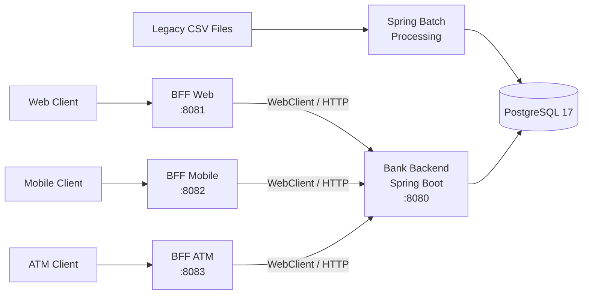

# BancoXYZ

Backend engineering project developed around the progressive modernization of legacy banking processes using **Java, Spring Boot, Spring Batch, PostgreSQL and the Backend for Frontend pattern**.

The repository evolves from batch-oriented data processing toward a multi-channel backend architecture for **Web, Mobile and ATM clients**.

> Batch Processing • Data Engineering • Backend Architecture • BFF • Security

---

## 📌 Overview

**BancoXYZ** is an academic backend project developed through several implementation stages.

The first stages focus on modernizing legacy banking processes using **Spring Batch**, including:

- Daily transaction processing
- Monthly interest calculation
- Annual account statement generation
- CSV ingestion
- Data validation and normalization
- Error handling
- Retry and skip policies
- Reconciliation and idempotency
- PostgreSQL persistence
- Batch execution metadata
- Parallel processing and performance benchmarking

The project later evolves into a **Backend for Frontend (BFF)** architecture consisting of:

- A central banking backend
- BFF Web
- BFF Mobile
- BFF ATM

Each BFF adapts the information and operations exposed by the central backend according to the needs of its client channel.

---

## 🧭 Project Evolution

| Stage | Focus | Main Concepts |
|---|---|---|
| **Semana 1** | Initial batch modernization | Spring Batch, CSV processing, PostgreSQL |
| **Semana 2** | Batch consolidation | Persistence, execution validation, reconciliation |
| **Semana 3** | Reliability and performance | Retry, skip, parallelism, benchmarks, idempotency |
| **Semana 4** | Backend for Frontend | Web, Mobile and ATM BFFs, WebClient, Spring Security |

Each stage is preserved independently inside the repository to show the technical evolution of the solution.

---

## 🏗️ Overall Architecture



The batch layer processes and persists banking data.

The later BFF architecture reuses that persisted information through a central backend, while client-specific services adapt responses and operations without accessing PostgreSQL directly.

---

# ⚙️ Batch Processing

## Three Core Jobs

The batch implementation contains three independent Spring Batch Jobs.

### 💳 `transaccionJob`

Processes daily banking transactions from:

```text
transacciones.csv
```

The Job performs:

- Transaction validation
- Credit/debit normalization
- Negative debit correction
- Functional duplicate detection
- Persistence
- Daily financial summary generation
- Reconciliation between executions

Functional duplicates are detected using:

```text
date
+
amount
+
transaction type
```

Duplicate records are preserved with:

```text
DUPLICADO
```

but excluded from financial totals.

The daily summary calculates:

```text
net_balance = total_credits - total_debits
```

---

### 💰 `cuentaInteresJob`

Processes monthly interest calculations from:

```text
intereses.csv
```

Academic interest rules:

```text
Savings account → 1%
Loan            → 2%
```

Calculation:

```text
interest = balance × rate
final_balance = balance + interest
```

This Job intentionally executes sequentially because multiple input records can reference the same account.

Keeping this process sequential prevents concurrent updates to the same functional entity.

---

### 📊 `estadoCuentaAnualJob`

Processes yearly banking movements from:

```text
cuentas_anuales.csv
```

Supported operations include:

```text
deposit
withdrawal
purchase
```

The process normalizes transaction types and monetary signs before consolidating:

- Total deposits
- Total withdrawals
- Total purchases
- Annual balance

The final state is identified by:

```text
account_id + year
```

preventing duplicated annual statements.

---

## 🔄 Spring Batch Pipeline

The processing model follows the standard Spring Batch architecture:

```text
CSV
 │
 ▼
FlatFileItemReader
 │
 ▼
ItemProcessor
 │
 ▼
ItemWriter
 │
 ▼
PostgreSQL
```

Additional Steps and Tasklets implement:

- Duplicate detection
- Daily summaries
- Reconciliation
- Historical state management

---

## 🧩 Reconciliation & Idempotency

The batch implementation supports repeated executions without generating unnecessary functional duplicates.

Processed entities can maintain:

```text
active
last_instance_id
```

During a new execution:

```text
Present in current dataset
        → active = true

Missing from current dataset
        → active = false

Reappears later
        → active = true
```

This approach preserves historical information while keeping the current dataset state synchronized.

---

## ⚠️ Fault Tolerance

Batch Steps use Spring Batch fault-tolerance mechanisms.

Recoverable invalid records can be skipped without necessarily failing the entire Job.

The project handles errors occurring during:

```text
READ
PROCESS
WRITE
```

Rejected records are persisted in:

```text
registros_rechazados
```

with information about:

- Job
- Step
- Processing phase
- Original content
- Exception type
- Error message
- Job instance
- Registration date

The configured academic skip limit is:

```properties
app.batch.skip-limit=750
```

---

## 🔁 Retry Strategy

Transient persistence failures can be retried before declaring a Step failed.

Configuration:

```properties
app.batch.retry-max-retries=3
app.batch.retry-delay-ms=500
```

A controlled retry simulation was also implemented to validate the recovery mechanism experimentally.

---

# ⚡ Performance Engineering

Semana 3 introduced controlled performance testing instead of selecting concurrency parameters arbitrarily.

The benchmark evaluated:

- Number of worker threads
- Chunk size
- Stability under load

Each stable configuration was executed multiple times.

### Thread Benchmark

With:

```text
chunk-size = 10
```

the measured averages were:

| Threads | Average |
|---:|---:|
| 1 | 7931.971 ms |
| 2 | 5465.317 ms |
| **3** | **4883.985 ms** |
| 4 | 5373.557 ms |

Three threads produced the best average result.

Compared with a single thread, this represented an improvement of approximately:

```text
38.4%
```

Increasing the thread count to four introduced additional coordination overhead and did not improve performance.

---

### Chunk Benchmark

Using three threads:

| Chunk | Result | Average |
|---:|---|---:|
| 5 | COMPLETED | 6519.185 ms |
| **10** | **COMPLETED** | **5865.691 ms** |
| 25 | FAILED | — |
| 50 | FAILED | — |

Chunks of `25` and `50` saturated the configured executor and produced task rejection errors.

The final stable configuration became:

```properties
app.batch.threads=3
app.batch.chunk-size=10
app.batch.queue-capacity=20
```

The configuration was selected based on both:

```text
performance + stability
```

rather than throughput alone.

---

## 📈 Final Batch Execution

The final three Jobs completed successfully with the selected configuration:

| Job | Mode | Threads | Chunk | Result |
|---|---|---:|---:|---|
| `transaccionJob` | Parallel | 3 | 10 | ✅ COMPLETED |
| `cuentaInteresJob` | Sequential | 1 | 10 | ✅ COMPLETED |
| `estadoCuentaAnualJob` | Parallel | 3 | 10 | ✅ COMPLETED |

The test datasets contained approximately 1,000 input records per process.

---

# 🌐 Backend for Frontend

Semana 4 extends BancoXYZ with a **Backend for Frontend architecture**.

The implementation contains four independent Spring Boot applications:

```text
Semana 4/
│
├── bank-backend/
│
└── bff/
    ├── bff-web/
    ├── bff-mobile/
    └── bff-atm/
```

The BFFs communicate with the central backend through HTTP using **Spring WebClient**.

They do not access PostgreSQL directly.

---

## 🏦 Bank Backend

Port:

```text
8080
```

The central backend provides access to banking information previously persisted in PostgreSQL.

Main resources include:

- Accounts
- Processed transactions
- Annual account statements
- Daily transaction summaries
- Withdrawal operations

### Endpoints

| Method | Endpoint | Description |
|---|---|---|
| `GET` | `/api/cuentas` | List accounts |
| `GET` | `/api/cuentas/{id}` | Get account |
| `POST` | `/api/cuentas/{id}/retiro` | Execute withdrawal |
| `GET` | `/api/transacciones` | List processed transactions |
| `GET` | `/api/transacciones/{id}` | Get processed transaction |
| `GET` | `/api/estados-cuenta` | List annual statements |
| `GET` | `/api/estados-cuenta/cuenta/{cuentaId}` | Statements by account |
| `GET` | `/api/resumenes` | List daily summaries |
| `GET` | `/api/resumenes/{fecha}` | Daily summary by date |

The backend accesses the same domain tables generated by the batch-oriented stages, including:

```text
cuentas_intereses
transacciones_procesadas
estados_cuenta_anuales
resumen_transacciones_diarias
```

---

# 🖥️ BFF Web

Port:

```text
8081
```

The Web BFF provides richer responses suitable for interfaces that can display more complete banking information.

Endpoints:

| Method | Endpoint |
|---|---|
| `GET` | `/api/web/cuentas` |
| `GET` | `/api/web/cuentas/{id}` |
| `GET` | `/api/web/cuentas/{id}/detalle` |

The detail operation combines data obtained from multiple central-backend resources into a Web-oriented response.

---

# 📱 BFF Mobile

Port:

```text
8082
```

The Mobile BFF intentionally reduces the amount of information sent to the client.

Endpoints:

| Method | Endpoint |
|---|---|
| `GET` | `/api/mobile/cuentas` |
| `GET` | `/api/mobile/cuentas/{id}/resumen` |

A mobile account summary contains only the data required by the channel, such as:

```json
{
  "cuentaId": 145,
  "nombre": "Steve Rogers",
  "tipo": "ahorro",
  "estado": "PROCESADO",
  "saldoFinal": 1620.00
}
```

This demonstrates one of the central objectives of the BFF pattern: different clients do not need to consume identical representations.

---

# 🏧 BFF ATM

Port:

```text
8083
```

The ATM BFF focuses on small and critical banking operations.

Endpoints:

| Method | Endpoint |
|---|---|
| `GET` | `/api/atm/cuentas/{id}/saldo` |
| `POST` | `/api/atm/cuentas/{id}/retiro` |

Example withdrawal request:

```json
{
  "monto": 500
}
```

The central backend validates withdrawal operations before updating the account balance.

---

# 🔐 Channel Security

The three BFFs use **Spring Security with HTTP Basic authentication**.

Each channel has an independent security configuration and credentials.

The Web and Mobile BFFs explicitly enforce their corresponding channel roles.

The ATM service requires authenticated access and is configured with its own ATM credentials.

This separation prevents unauthenticated clients from directly accessing BFF operations.

---

## 🛠️ Technology Stack

### Backend & Batch

- Java 21
- Spring Boot 4.1.x
- Spring Batch 6
- Spring Data JPA
- Hibernate
- Spring Validation
- Spring Web

### BFF Architecture

- Spring Web
- Spring WebFlux
- WebClient
- Spring Security
- HTTP Basic
- DTO-based response adaptation

### Data

- PostgreSQL 17
- Spring Batch JDBC JobRepository

### Development & Infrastructure

- Maven / Maven Wrapper
- Docker
- Docker Compose
- Git
- GitHub
- Postman

---

## 📁 Repository Structure

```text
bancoxyzbatch/
│
├── Semana 1/
│   └── Initial BancoXYZ Batch implementation
│
├── Semana 2/
│   └── Batch processing evolution and execution evidence
│
├── Semana 3/
│   ├── benchmarks/
│   ├── evidencias/
│   ├── Propuesta_Tecnica.md
│   └── Optimized Spring Batch implementation
│
├── Semana 4/
│   ├── bank-backend/
│   ├── bff/
│   │   ├── bff-web/
│   │   ├── bff-mobile/
│   │   └── bff-atm/
│   └── README.md
│
├── docs/
│   └── BancoXYZ_BFF_Documentacion_Semana4.pdf
│
└── README.md
```

---

## 🚀 Running the Batch Environment

A PostgreSQL 17 container can be started from the corresponding batch stage using Docker Compose:

```bash
docker compose up -d
```

The database is available by default on:

```text
localhost:5432
```

Batch Jobs are selected explicitly using the controlled Job runner.

Example:

```bash
./mvnw spring-boot:run \
  -Dspring-boot.run.arguments="--app.batch.job=transaccionJob --app.batch.run-id=1001"
```

Other available Jobs:

```text
cuentaInteresJob
estadoCuentaAnualJob
```

A different run ID identifies a new Spring Batch `JobInstance`.

---

## 🚀 Running the BFF Architecture

Start PostgreSQL first.

Then start the central backend:

```bash
cd "Semana 4/bank-backend"
./mvnw spring-boot:run
```

The backend runs on:

```text
http://localhost:8080
```

Start each BFF independently:

```bash
cd "Semana 4/bff/bff-web"
mvn spring-boot:run
```

```bash
cd "Semana 4/bff/bff-mobile"
mvn spring-boot:run
```

```bash
cd "Semana 4/bff/bff-atm"
mvn spring-boot:run
```

Result:

```text
Bank Backend → 8080
BFF Web      → 8081
BFF Mobile   → 8082
BFF ATM      → 8083
```

---

## 🧪 Validation

The project was validated through:

- Spring Batch execution logs
- PostgreSQL result inspection
- Batch reconciliation tests
- Retry simulation
- Duplicate detection
- Controlled performance benchmarks
- Postman
- Authenticated and unauthenticated BFF requests
- Web response validation
- Mobile response reduction
- ATM balance queries
- ATM withdrawal operations

The BFF validation produced successful `HTTP 200 OK` responses for correctly authenticated operations and rejected unauthenticated requests. 

---

## 📚 Documentation

### Project Stages

- [Semana 1 — Batch](./Semana%201/README.md)
- [Semana 2 — Batch](./Semana%202/README.md)
- [Semana 3 — Performance & Reliability](./Semana%203/README.md)
- [Semana 4 — Backend for Frontend](./Semana%204/README.md)

### Technical Report

📄 [BancoXYZ — BFF Technical Report](./docs/BancoXYZ_BFF_Documentacion_Semana4.pdf)

---

## 🎓 Academic Context

This project was developed as part of the **Analista Programador** program at **Duoc UC, Chile**, for the **Desarrollo Backend III (PBY2203)** course.

Developed collaboratively by:

- **Natalia Alvarado**
- **Egor Llancapichun**

The repository preserves the progressive technical evolution of the solution rather than replacing earlier implementation stages.

---

## 👩‍💻 Profile

Portfolio repository maintained by:

**Natalia Alvarado — LadyRed145**

[GitHub Profile](https://github.com/LadyRed145)