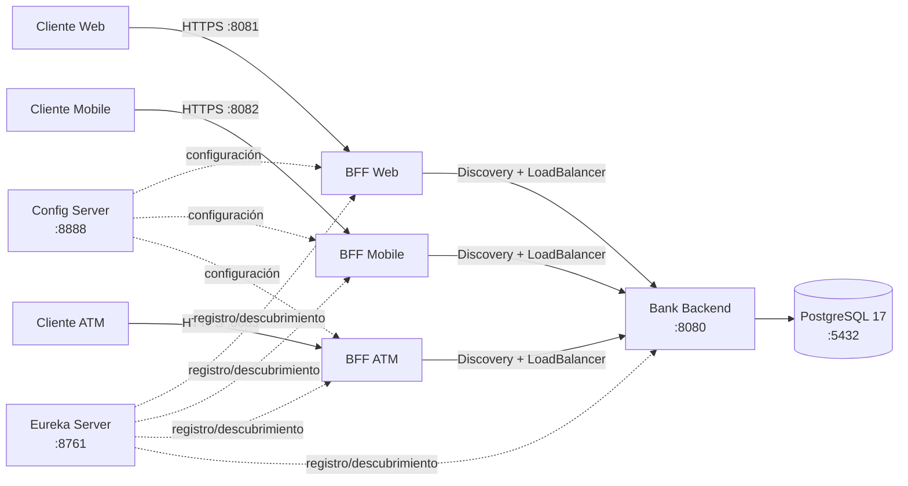

# 🏦 BancoXYZ — Microservicios resilientes con Spring Cloud

> **Desarrollo Backend III (PBY2203) · Semana 6 · Grupo 13**  
> Configuración centralizada, Service Discovery, BFF por canal, seguridad, tolerancia a fallos y observabilidad.

---

**Repositorio:** `https://github.com/LadyRed145/bancoxyzbatch/tree/main/Semana%206`

---

## ✨ Resumen

BancoXYZ evoluciona la solución de migración bancaria hacia una arquitectura distribuida basada en **Spring Boot + Spring Cloud**. La solución mantiene un `bank-backend` como API central sobre PostgreSQL y agrega tres **Backend for Frontend (BFF)** independientes para Web, Mobile y ATM.

La configuración de los BFF se centraliza mediante **Spring Cloud Config Server**, los servicios se registran en **Eureka Service Discovery**, y la comunicación hacia `BANK-BACKEND` utiliza **Spring Cloud LoadBalancer**. Cada BFF incorpora autenticación/autorización por canal y una capa de resiliencia con **Circuit Breaker, Retry, Rate Limiter, timeout y fallback**.

La implementación fue construida como continuidad del proyecto BancoXYZ y utiliza los datos migrados a partir del repositorio legacy indicado en la actividad: `KariVillagran/bank_legacy_data`.

---

## ✅ Estado funcional validado

| Capacidad | Estado | Evidencia observada |
|---|:---:|---|
| Config Server centralizado | ✅ | Configuración consumida por WEB, MOBILE y ATM |
| Eureka Service Discovery | ✅ | `BANK-BACKEND`, `BFF-WEB`, `BFF-MOBILE`, `BFF-ATM` registrados |
| Spring Cloud LoadBalancer | ✅ | Resolución de `bank-backend` mediante Discovery |
| Autenticación | ✅ | Token ausente/desconocido → `401` |
| Autorización por rol | ✅ | Token válido de otro canal → `403` |
| Actuator | ✅ | Health `UP` y endpoints Resilience4j visibles |
| Circuit Breaker | ✅ | `CLOSED → OPEN → HALF_OPEN → CLOSED` |
| Fallback | ✅ | Backend no disponible → `503 Service Unavailable` |
| Retry | ✅ | 3 intentos totales en operaciones GET seguras |
| Rate Limiter | ✅ | 10 solicitudes permitidas + 20 rechazadas con `429` en ráfaga de 30 |
| Maven multi-módulo | ✅ | Reactor `7/7 SUCCESS` |
| Docker Compose | ✅ | Definición válida de 7 servicios |

---

## 🧭 Arquitectura



### Componentes

| Componente | Puerto | Protocolo | Responsabilidad |
|---|---:|---|---|
| Config Server | `8888` | HTTP | Configuración centralizada de los BFF |
| Eureka Server | `8761` | HTTP | Registro y descubrimiento de servicios |
| Bank Backend | `8080` | HTTP | API bancaria central y acceso a PostgreSQL |
| BFF Web | `8081` | HTTPS | Contrato completo para canal Web |
| BFF Mobile | `8082` | HTTPS | Payload reducido para dispositivos móviles |
| BFF ATM | `8083` | HTTPS | Saldo y retiro con contrato mínimo |
| PostgreSQL | `5432` | TCP | Persistencia de los datos migrados |

---

## 🛡️ Estrategia de resiliencia

Los tres BFF usan la instancia Resilience4j `bankbackend`.

### Circuit Breaker

Configuración centralizada:

```properties
sliding-window-type=COUNT_BASED
sliding-window-size=5
minimum-number-of-calls=3
failure-rate-threshold=50
wait-duration-in-open-state=10s
permitted-number-of-calls-in-half-open-state=2
automatic-transition-from-open-to-half-open-enabled=true
```

Comportamiento validado:

```text
CLOSED
  │ fallos técnicos
  ▼
OPEN
  │ espera configurada
  ▼
HALF_OPEN
  │ probes correctos
  ▼
CLOSED
```

Cuando el circuito está abierto, las solicitudes no permitidas se contabilizan mediante `notPermittedCalls` y la respuesta al cliente se mantiene controlada.

### Retry

```properties
max-attempts=3
wait-duration=200ms
```

`max-attempts=3` significa **tres intentos totales**: llamada inicial + hasta dos reintentos.

Se reintentan únicamente fallos técnicos normalizados (`BackendNoDisponibleException` y `BackendTimeoutException`). Los errores funcionales `4xx` no se reintentan.

> **Decisión de seguridad:** el `POST` de retiro del ATM **no utiliza Retry** porque no es una operación idempotente. Un reintento automático podría duplicar un débito si el backend alcanzó a procesar la operación pero la respuesta se perdió.

### Rate Limiter

```properties
limit-for-period=10
limit-refresh-period=1s
timeout-duration=0ms
```

Una ráfaga concurrente de 30 solicitudes produce de forma controlada respuestas `200` y `429 Too Many Requests`.

El Rate Limiter se aplica por fuera del Circuit Breaker, evitando que un exceso de tráfico sea interpretado como una falla del Bank Backend.

### Timeout + fallback

```properties
backend.timeout=3s
```

Comportamiento:

| Situación | Respuesta |
|---|---:|
| Backend responde correctamente | `200` |
| Error funcional del backend | Se conserva el status original |
| Backend no disponible | `503 Service Unavailable` |
| Timeout técnico | `504 Gateway Timeout` |
| Exceso de solicitudes | `429 Too Many Requests` |

---

## 🔐 Seguridad

Cada BFF usa HTTPS, sesiones stateless y Bearer Token académico asociado a un rol.

| Canal | Rol | Token de demostración |
|---|---|---|
| Web | `ROLE_WEB` | `bancoxyz-web-demo-token-2026` |
| Mobile | `ROLE_MOBILE` | `bancoxyz-mobile-demo-token-2026` |
| ATM | `ROLE_ATM` | `bancoxyz-atm-demo-token-2026` |

Comportamiento validado:

```text
Sin token                        -> 401 Unauthorized
Token desconocido                -> 401 Unauthorized
WEB token -> BFF Mobile          -> 403 Forbidden
MOBILE token -> BFF ATM          -> 403 Forbidden
ATM token -> BFF Web             -> 403 Forbidden
Token correcto del canal         -> acceso permitido
```

`/actuator/health` e `/actuator/info` permanecen disponibles para monitoreo. Los demás endpoints de Actuator requieren el rol correspondiente al BFF.

> Los tokens y certificados incluidos son exclusivamente académicos. En producción deben reemplazarse por OAuth2/OIDC, JWT firmados, gestión externa de secretos y certificados emitidos por una CA confiable.

---

## 📡 Endpoints por canal

### Web — `https://localhost:8081`

```text
GET /api/web/cuentas
GET /api/web/cuentas/{id}
GET /api/web/cuentas/{id}/detalle
```

### Mobile — `https://localhost:8082`

```text
GET /api/mobile/cuentas
GET /api/mobile/cuentas/{id}/resumen
```

### ATM — `https://localhost:8083`

```text
GET  /api/atm/cuentas/{id}/saldo
POST /api/atm/cuentas/{id}/retiro
```

---

## 👀 Observabilidad con Actuator

Los BFF exponen los endpoints necesarios para comprobar salud y resiliencia:

```text
/actuator/health
/actuator/info
/actuator/metrics
/actuator/circuitbreakers
/actuator/circuitbreakerevents
/actuator/retries
/actuator/retryevents
/actuator/ratelimiters
/actuator/ratelimiterevents
```

La evidencia principal utiliza:

- `health` para demostrar disponibilidad;
- `circuitbreakers` para observar `CLOSED`, `OPEN` y `HALF_OPEN`;
- `retryevents` para demostrar intentos `1`, `2` y `3`;
- códigos HTTP reales `200/429` para demostrar el Rate Limiter.

---

## 📁 Estructura del proyecto

```text
bancoxyzbatch/
├── README.md
├── Propuesta_Tecnica.md
├── docker-compose.yml
├── .env.example
├── pom.xml
├── mvnw
├── .mvn/
└── Semana 6/
    ├── config-server/
    ├── discovery-server/
    ├── bank-backend/
    ├── config-repo/
    │   ├── bff-web.properties
    │   ├── bff-mobile.properties
    │   └── bff-atm.properties
    ├── bff/
    │   ├── bff-web/
    │   ├── bff-mobile/
    │   └── bff-atm/
    ├── data/legacy/
    ├── database/
    │   ├── 01_schema.sql
    │   ├── 02_seed_processed_snapshot.sql
    │   └── README.md
    └── scripts/
        ├── inicializar_bd.fish
        ├── verificar_actuator_resilience.fish
        ├── verificar_bff.fish
        └── verificar_retiro_controlado.fish
```

---

## 🧩 Organización interna de los BFF

```text
controller -> contrato HTTP del canal
service    -> coordinación del caso de uso
client     -> integración HTTP + resiliencia
mapper     -> transformación del contrato cuando aporta valor
dto        -> contratos de entrada/salida
exception  -> traducción semántica de errores
config     -> seguridad y configuración técnica
```

Ningún BFF accede directamente a PostgreSQL, repositorios JPA o entidades internas del Bank Backend.

---

## 🗃️ Datos y persistencia

La solución conserva los CSV legacy y una base PostgreSQL reproducible mediante scripts SQL.

El contenedor `postgres:17` carga automáticamente:

```text
Semana 6/database/01_schema.sql
Semana 6/database/02_seed_processed_snapshot.sql
```

Esto permite ejecutar la Semana 6 sin depender del volumen local utilizado durante semanas anteriores.

---

## ⚙️ Requisitos

- Java 21
- Docker + Docker Compose
- Fish shell para los scripts incluidos
- `curl`
- `jq`
- `openssl`

---

# 🚀 Ejecución

## Opción A — Stack completo con Docker Compose

Desde la raíz del proyecto:

```fish
docker compose config
docker compose up -d --build
```

Comprobar servicios:

```fish
docker compose ps
```

Detener:

```fish
docker compose down
```

> `docker compose down -v` elimina también el volumen PostgreSQL. Utilizarlo únicamente cuando se quiera reconstruir la base desde cero.

---

## Opción B — Ejecución local por servicios

### 1. PostgreSQL

```fish
fish "Semana 6/scripts/inicializar_bd.fish"
```

### 2. Config Server

```fish
cd "Semana 6/config-server"
./mvnw spring-boot:run
```

### 3. Eureka Discovery Server

```fish
cd "Semana 6/discovery-server"
./mvnw spring-boot:run
```

### 4. Bank Backend

```fish
cd "Semana 6/bank-backend"
./mvnw spring-boot:run
```

### 5. BFF Web

```fish
cd "Semana 6/bff/bff-web"
./mvnw spring-boot:run
```

### 6. BFF Mobile

```fish
cd "Semana 6/bff/bff-mobile"
./mvnw spring-boot:run
```

### 7. BFF ATM

```fish
cd "Semana 6/bff/bff-atm"
./mvnw spring-boot:run
```

Puertos esperados:

```fish
ss -ltnp | grep -E '(:8888|:8761|:8080|:8081|:8082|:8083)'
```

---

## 🧱 Compilación multi-módulo

Desde la raíz:

```fish
./mvnw clean compile -DskipTests
```

El reactor incluye:

```text
config-server
 discovery-server
bank-backend
bff-web
bff-mobile
bff-atm
BancoXYZ - Semana 6 (agregador)
```

Resultado validado durante la preparación de la entrega:

```text
7/7 SUCCESS
BUILD SUCCESS
```

---

# 🧪 Verificación

## Verificación funcional BFF

```fish
fish "Semana 6/scripts/verificar_bff.fish"
```

Comprueba funcionalidad de los tres canales, HTTPS, autenticación, autorización y validaciones seguras.

## Actuator + Resilience4j

```fish
fish "Semana 6/scripts/verificar_actuator_resilience.fish"
```

Es una auditoría **no destructiva** que comprueba:

- Health `UP` en WEB/MOBILE/ATM.
- Registro `bankbackend` en Circuit Breaker, Retry y Rate Limiter.
- APIs principales con HTTP `200`.
- Rate Limiter real mediante ráfagas concurrentes.
- Que los `429` no contaminen el Circuit Breaker.

## Retiro controlado

```fish
fish "Semana 6/scripts/verificar_retiro_controlado.fish"
```

La prueba utiliza un fixture controlado para demostrar el flujo ATM sin alterar permanentemente las cuentas utilizadas como evidencia.

---

## 🔥 Prueba manual de Retry y Circuit Breaker

Para demostrar tolerancia a fallos se detiene **únicamente** `bank-backend` y se mantienen activos Config Server, Eureka y los tres BFF.

Con backend caído, una lectura segura devuelve `503` y `/actuator/retryevents` registra:

```text
attempt 1 -> RETRY
attempt 2 -> RETRY
attempt 3 -> ERROR
```

Al superar el umbral configurado, el Circuit Breaker transiciona a `OPEN`. Posteriormente pasa automáticamente a `HALF_OPEN`; con el backend recuperado y dos probes correctos vuelve a `CLOSED`.

---

## 📸 Documentación de evidencias

La documentación final de ejecución se entrega como archivo separado:

```text
BancoXYZ_BFF_Evidencias_Semana6.pdf
```

El documento contiene las evidencias mínimas y suficientes para la Semana 6:

1. compilación completa `7/7 SUCCESS`;
2. configuración centralizada mediante Config Server;
3. registro de servicios en Eureka;
4. ejecución de las APIs Web, Mobile y ATM sobre los datos migrados;
5. autenticación `401` y autorización cruzada `403`;
6. auditoría de Actuator y mecanismos Resilience4j;
7. Retry de tres intentos en los tres canales;
8. Circuit Breaker en `OPEN` con solicitudes no permitidas;
9. recuperación `HALF_OPEN -> CLOSED`;
10. repositorio GitHub final de Semana 6.

La documentación y sus capturas se mantienen fuera del repositorio de código para evitar duplicar artefactos de entrega.

---

## 🎯 Correspondencia con la pauta de Semana 6

| Criterio | Implementación |
|---|---|
| Config Server funcional y centralizado | Configuración externa para los tres BFF mediante `config-repo` |
| Service Discovery con tres microservicios | Eureka registra los tres BFF y adicionalmente `BANK-BACKEND` |
| Tres microservicios con tolerancia a fallos y autenticación | WEB, MOBILE y ATM incluyen Circuit Breaker, Retry seguro, Rate Limiter, fallback y seguridad |
| Autenticación y autorización funcional | Bearer Tokens + roles específicos + respuestas `401/403` |

---

## 🧠 Decisiones de diseño destacadas

- Configuración de resiliencia fuera del código Java mediante Config Server.
- Service Discovery evita acoplar los BFF a una IP fija del backend.
- Retry sólo para operaciones de lectura/idempotentes.
- Retiro ATM excluido de Retry para impedir dobles débitos.
- Rate Limiter externo al Circuit Breaker para que un `429` no cuente como falla del backend.
- BFF desacoplados de persistencia.
- Errores técnicos traducidos a códigos HTTP semánticos.
- Actuator utilizado como evidencia observable del estado interno.
- Contenedores con healthchecks y dependencias explícitas.
- Configuración sensible externalizable mediante variables de entorno.

---

## 🌱 Evolución productiva

Para un despliegue real se recomienda incorporar:

- OAuth2 / OpenID Connect.
- JWT firmados y de corta duración.
- Secret manager externo.
- Certificados TLS emitidos por una CA.
- TLS interno entre servicios.
- Métricas centralizadas con Prometheus/Grafana u otra plataforma equivalente.
- Trazabilidad distribuida.
- Testcontainers.
- Pipeline CI/CD.
- Gestión de configuración por ambientes.

---

## 📌 Nota académica

Los tokens, certificados y valores por defecto existen para facilitar una ejecución reproducible en el entorno académico. No representan una configuración de seguridad recomendada para producción.

---

**BancoXYZ · Semana 6 — Microservicios resilientes, observables y protegidos con Spring Cloud.**
