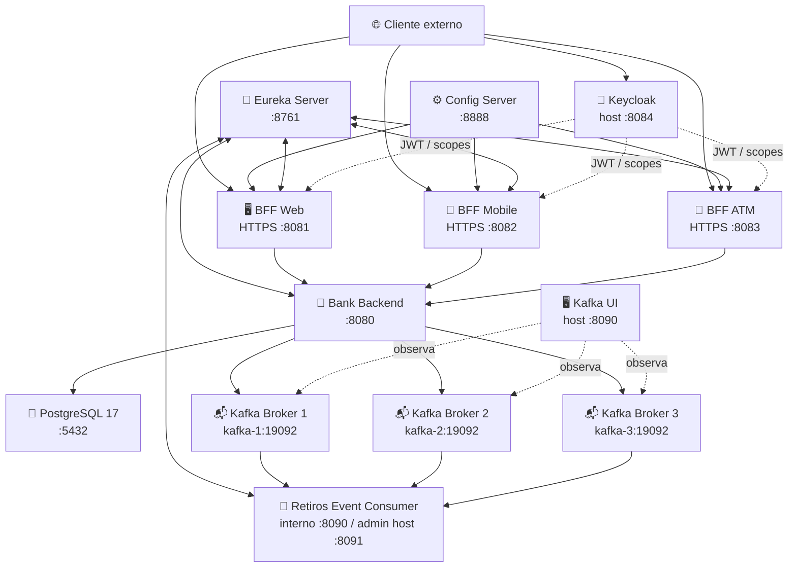
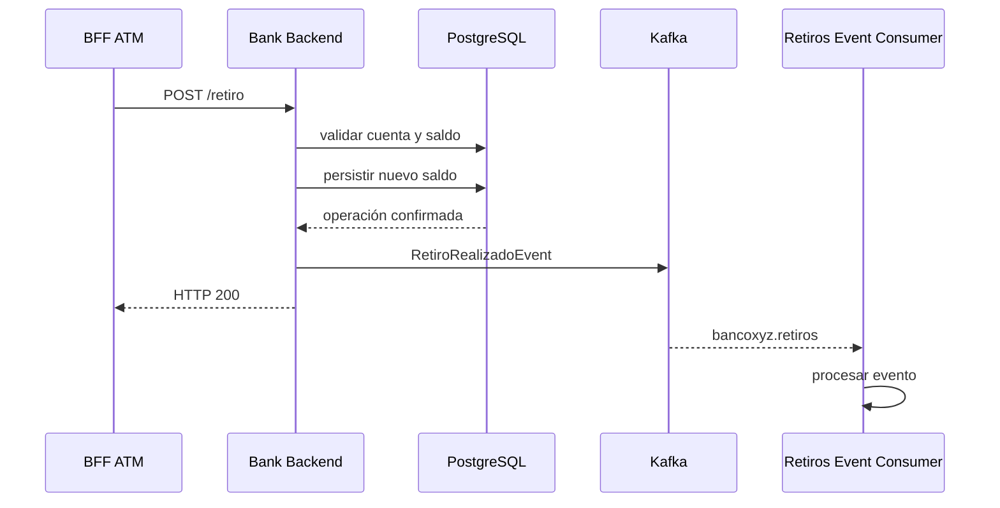
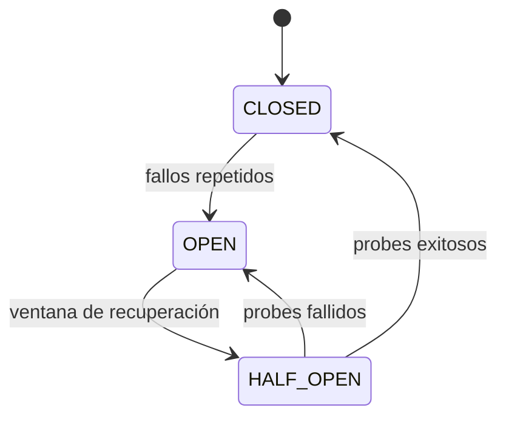

# 🏦 BancoXYZ — Microservicios resilientes, seguros y orientados a eventos

> **Desarrollo Backend III (PBY2203) · Semana 8 · Entrega individual**
> **Autora: Natalia Alvarado**
> Spring Boot · Spring Cloud · OAuth2 · Keycloak · Resilience4j · Apache Kafka · PostgreSQL · Docker Compose · AWS EC2

---

## ✨ Resumen

BancoXYZ es una solución bancaria distribuida basada en microservicios. La **Semana 8** consolida la arquitectura construida en las entregas anteriores e integra los requerimientos finales de **seguridad OAuth2, resiliencia, mensajería asíncrona, contenerización, observabilidad y despliegue Cloud**.

La arquitectura final está compuesta por **13 servicios orquestados mediante Docker Compose**. La versión Kafka 3×3 fue validada localmente y posteriormente redeplegada y revalidada en **AWS EC2** con la misma versión funcional. La evidencia definitiva se genera sobre esta arquitectura ya validada.

| Área | Estado final |
|---|---|
| Docker Compose | ✅ válido |
| Servicios locales | ✅ `13/13 operativos` (`12 healthy` + Kafka UI `running`) |
| OAuth2 / Keycloak | ✅ `200 / 401 / 403` |
| Kafka entre microservicios | ✅ 3 brokers + 3 particiones + RF=3 + productor/consumidor + `lag 0` |
| Resilience4j | ✅ `CLOSED → OPEN → HALF_OPEN → CLOSED` |
| AWS EC2 final | ✅ 13 servicios operativos y batería funcional validada |
| Secretos | ✅ externalizados y fuera de Git |
| Evidencia definitiva | ⏳ pendiente de regenerar sobre la versión final validada |

### ✅ Criterio de rúbrica — OAuth2 / Keycloak (implementado)

El requisito de **OAuth2 no corresponde a una mejora futura**: está **implementado, integrado y validado** en la solución final. Los tres BFF funcionan como **Spring Resource Server JWT**, utilizan clientes y scopes independientes en Keycloak y fueron probados en AWS EC2 con los resultados esperados:

```text
bff-web-client     + bancoxyz.web     → HTTP 200
bff-mobile-client  + bancoxyz.mobile  → HTTP 200
bff-atm-client     + bancoxyz.atm     → HTTP 200

Sin token / token inválido             → HTTP 401
Token válido con scope incorrecto       → HTTP 403
```

La mejora futura mencionada en este documento se refiere únicamente al **endurecimiento productivo del transporte** —DNS, TLS válido, reverse proxy y `sslRequired`—, no a la implementación de OAuth2, que ya forma parte funcional de Semana 8.

---

## 🧭 Arquitectura final


```mermaid
flowchart TB
    EXT["🌐 Cliente externo"] --> KC["🔐 Keycloak<br/>host :8084"]
    EXT --> WEB["🖥️ BFF Web<br/>HTTPS :8081"]
    EXT --> MOB["📱 BFF Mobile<br/>HTTPS :8082"]
    EXT --> ATM["🏧 BFF ATM<br/>HTTPS :8083"]

    CFG["⚙️ Config Server<br/>:8888"] --> WEB
    CFG --> MOB
    CFG --> ATM

    EUREKA["🧭 Eureka Server<br/>:8761"] <--> WEB
    EUREKA <--> MOB
    EUREKA <--> ATM
    EUREKA <--> BACK["🏦 Bank Backend<br/>:8080"]
    EUREKA <--> CONSUMER["📨 Retiros Event Consumer<br/>interno :8090 / admin host :8091"]

    WEB --> BACK
    MOB --> BACK
    ATM --> BACK

    BACK --> DB["💾 PostgreSQL 17<br/>:5432"]
    BACK --> K1["📬 Kafka Broker 1<br/>kafka-1:19092"]
    BACK --> K2["📬 Kafka Broker 2<br/>kafka-2:19092"]
    BACK --> K3["📬 Kafka Broker 3<br/>kafka-3:19092"]
    K1 --> CONSUMER
    K2 --> CONSUMER
    K3 --> CONSUMER
    KUI["🖥️ Kafka UI<br/>host :8090"] -. observa .-> K1
    KUI -. observa .-> K2
    KUI -. observa .-> K3

    KC -. JWT / scopes .-> WEB
    KC -. JWT / scopes .-> MOB
    KC -. JWT / scopes .-> ATM
```

### Flujo natural

```text
Cliente
  │
  ├── OAuth2 / Keycloak
  │
  ▼
BFF Web / Mobile / ATM
  │
  ├── Config Server
  ├── Eureka + LoadBalancer
  ├── Resilience4j
  │
  ▼
Bank Backend
  │
  ├── PostgreSQL
  │
  └── Kafka 3 brokers / 3 particiones / RF=3 ──► Retiros Event Consumer
```

---

## 🧩 Servicios del stack

| # | Servicio | Responsabilidad principal | Exposición |
|---:|---|---|---|
| 1 | PostgreSQL 17 | Persistencia bancaria | `127.0.0.1:5432` |
| 2 | Kafka Broker 1 | Broker/controller KRaft | `127.0.0.1:9092` / `kafka-1:19092` |
| 3 | Kafka Broker 2 | Broker/controller KRaft | `127.0.0.1:9094` / `kafka-2:19092` |
| 4 | Kafka Broker 3 | Broker/controller KRaft | `127.0.0.1:9096` / `kafka-3:19092` |
| 5 | Kafka UI 0.7.2 | Observación del cluster, topic y consumer groups | `127.0.0.1:8090` |
| 6 | Keycloak 26.8.0 | OAuth2 y emisión de JWT | `0.0.0.0:8084` |
| 7 | Config Server | Configuración centralizada | `127.0.0.1:8888` |
| 8 | Eureka Discovery Server | Registro y descubrimiento | `127.0.0.1:8761` |
| 9 | Bank Backend | Lógica bancaria, persistencia y productor Kafka | `127.0.0.1:8080` |
| 10 | Retiros Event Consumer | Consumo independiente + administración segura del listener | interno `:8090`, host `127.0.0.1:8091` |
| 11 | BFF Web | Contrato Web | `0.0.0.0:8081` |
| 12 | BFF Mobile | Contrato Mobile | `0.0.0.0:8082` |
| 13 | BFF ATM | Contrato ATM | `0.0.0.0:8083` |

Los tres brokers trabajan en **KRaft**, con listeners `INTERNAL`, `EXTERNAL` y `CONTROLLER`. El topic `bancoxyz.retiros` usa **3 particiones, factor de replicación 3 y `min.insync.replicas=2`**. Kafka UI y la API administrativa del consumer permanecen ligadas a loopback; en EC2 se consultan mediante túnel SSH en vez de abrir puertos públicos. La replicación tolera la caída de un broker/contenedor dentro del laboratorio, pero al ejecutarse los tres brokers sobre el mismo host **no sustituye alta disponibilidad multi-host o multi-AZ**.

---

## 🔐 Seguridad con OAuth2 y Keycloak

BancoXYZ utiliza **OAuth2.0 Client Credentials** mediante Keycloak.

### Realm

```text
bancoxyz
```

### Clientes

```text
bff-web-client
bff-mobile-client
bff-atm-client
```

### Scopes

```text
bancoxyz.web
bancoxyz.mobile
bancoxyz.atm
```

Cada BFF funciona como **Spring Resource Server JWT** y exige el scope correspondiente a su canal.

### Comportamiento validado

```text
Token correcto + scope correcto  → HTTP 200
Sin token / token inválido       → HTTP 401
Token válido + scope incorrecto  → HTTP 403
```

La validación final confirma los tres clientes y los tres escenarios de seguridad tanto localmente como en AWS EC2.

---

## 🔄 Rutas OAuth2 en Cloud

En AWS se separan explícitamente dos conceptos:

```text
Issuer público del JWT
    └── http://<ELASTIC_IP>:8084/realms/bancoxyz

Obtención local de token para scripts ejecutados dentro de EC2
    └── http://127.0.0.1:8084/realms/bancoxyz/protocol/openid-connect/token
```

Variables relevantes:

```text
KEYCLOAK_PUBLIC_URL
OAUTH2_ISSUER_URI
OAUTH2_TOKEN_URL
```

Esta separación evita que los scripts de la propia instancia intenten volver a entrar por la Elastic IP cuando el Security Group está restringido.

### SSL del realm en laboratorio

Para el despliegue académico se utiliza:

```json
"sslRequired": "none"
```

Esto permite validar Keycloak mediante HTTP sobre la Elastic IP en un entorno de laboratorio.

> ⚠️ **Producción:** `sslRequired: none` no debe utilizarse como configuración final. Un entorno productivo debe utilizar DNS, TLS válido y HTTPS real delante de Keycloak.

---

## 🔑 Variables de entorno y secretos

El archivo real `.env` está excluido de Git. Los valores sensibles se generan o suministran externamente.

Variables principales:

```text
POSTGRES_DB
POSTGRES_USER
POSTGRES_PASSWORD
DB_URL

KEYCLOAK_ADMIN_USERNAME
KEYCLOAK_ADMIN_PASSWORD
KEYCLOAK_PUBLIC_URL

OAUTH2_ISSUER_URI
OAUTH2_TOKEN_URL
OAUTH2_WEB_CLIENT_SECRET
OAUTH2_MOBILE_CLIENT_SECRET
OAUTH2_ATM_CLIENT_SECRET

SSL_KEYSTORE_PASSWORD
```

Preparación:

```fish
cp .env.example .env
```

Permisos recomendados:

```bash
chmod 600 .env
```

> **Certificados académicos:** el repositorio incluye certificados PKCS12 (`.p12`) únicamente para reproducir HTTPS en el entorno de laboratorio. Estos certificados de práctica utilizan `SSL_KEYSTORE_PASSWORD=changeit`; por eso, después de copiar `.env.example` a `.env`, debe reemplazarse el placeholder `CHANGE_ME` por `changeit` para ejecutar los BFF incluidos. No son certificados ni credenciales de producción.
>
> **Buenas prácticas:** `.env`, claves privadas reales, contraseñas, client secrets y certificados de producción no deben versionarse. En un entorno real, los certificados deben emitirse y administrarse fuera del repositorio.

---

## 📨 Mensajería asíncrona con Kafka

El retiro bancario genera un evento sólo después de completar la operación principal.


```mermaid
sequenceDiagram
    participant ATM as BFF ATM
    participant BE as Bank Backend
    participant DB as PostgreSQL
    participant K as Kafka
    participant C as Retiros Event Consumer

    ATM->>BE: POST /retiro
    BE->>DB: validar cuenta y saldo
    BE->>DB: persistir nuevo saldo
    DB-->>BE: operación confirmada
    BE->>K: RetiroRealizadoEvent
    BE-->>ATM: HTTP 200
    K-->>C: bancoxyz.retiros
    C->>C: procesar evento
```

### Topic

```text
bancoxyz.retiros
```

### Consumer Group

```text
bancoxyz-retiros-group
```

### Evento

```text
RetiroRealizadoEvent
├── cuentaId
├── monto
├── saldoFinal
└── tipo = RETIRO
```

### Validación funcional

```text
Brokers .................. 3
Particiones .............. 3
Replication Factor ....... 3
min.insync.replicas ...... 2
Producer ................. EVENTO PUBLICADO
Consumer ................. EVENTO CONSUMIDO
Consumer Group ........... bancoxyz-retiros-group
Lag final ................ 0
```

El consumidor fue separado de `bank-backend` para demostrar mensajería real entre microservicios y permitir escalamiento independiente.

### Administración segura del listener

El listener tiene id explícito `retirosListener` y se administra mediante `KafkaListenerEndpointRegistry`:

```text
GET  /api/kafka/consumer/estado
GET  /api/kafka/consumer/resumen
POST /api/kafka/consumer/pausar
POST /api/kafka/consumer/reanudar
```

La API funciona como **OAuth2 Resource Server JWT** y exige `SCOPE_bancoxyz.web`. La validación final, tanto local como en AWS EC2, demostró:

```text
Sin token ................ HTTP 401
Scope ATM ................ HTTP 403
Scope WEB ................ HTTP 200
Listener pausado ......... true
Lag durante pausa ........ 1
Reanudación .............. ACTIVO
Lag final ................ 0
Resumen .................. 3 brokers / 3 particiones / RF=3
```

---

## 🛡️ Resiliencia con Resilience4j

Los BFF protegen la comunicación con `BANK-BACKEND` mediante:

- **Circuit Breaker**;
- **Retry** para operaciones seguras;
- **Rate Limiter**;
- **Timeout**;
- traducción controlada de errores.

El retiro ATM **no utiliza Retry automático**, porque no es una operación idempotente y un reintento podría provocar doble débito.

### Ciclo validado


```mermaid
stateDiagram-v2
    [*] --> CLOSED
    CLOSED --> OPEN: fallos repetidos
    OPEN --> HALF_OPEN: ventana de recuperación
    HALF_OPEN --> OPEN: probes fallidos
    HALF_OPEN --> CLOSED: probes exitosos
```

### Evidencia EC2

```text
Operación normal ........ HTTP 200
Fallo 1 ................. HTTP 504
Fallo 2 ................. HTTP 504
Circuit Breaker ......... OPEN
Rechazo rápido .......... HTTP 503
Eventos Retry ........... 8
Backend restaurado ...... healthy
Recuperación ............ HALF_OPEN
Circuit Breaker final ... CLOSED
```

Resultado:

```text
CLOSED → OPEN → HALF_OPEN → CLOSED
```

---

## ⚙️ Configuración centralizada y Service Discovery

### Config Server

Puerto:

```text
8888
```

Configuraciones principales:

```text
Semana 8/config-repo/
├── bff-web.properties
├── bff-mobile.properties
└── bff-atm.properties
```

Centraliza parámetros de Eureka, nombre lógico del backend, timeouts, Circuit Breaker, Retry, Rate Limiter y Actuator.

### Eureka

Puerto:

```text
8761
```

Los BFF resuelven el backend mediante:

```text
BANK-BACKEND
```

con Spring Cloud LoadBalancer, evitando depender de direcciones IP rígidas.

---

## 🌐 Backend for Frontend

### Web — `HTTPS :8081`

```text
GET /api/web/cuentas
GET /api/web/cuentas/{id}
GET /api/web/cuentas/{id}/detalle
```

### Mobile — `HTTPS :8082`

```text
GET /api/mobile/cuentas
GET /api/mobile/cuentas/{id}/resumen
```

### ATM — `HTTPS :8083`

```text
GET  /api/atm/cuentas/{id}/saldo
POST /api/atm/cuentas/{id}/retiro
```

Los BFF utilizan certificados PKCS12 académicos y exigen `SSL_KEYSTORE_PASSWORD` mediante variable de entorno.

---

## 💾 Persistencia

PostgreSQL 17 mantiene el estado bancario.

Archivos:

```text
Semana 8/database/
```

Hostname interno:

```text
postgres:5432
```

El volumen persistente conserva los datos con:

```fish
docker compose down
```

Para reinicializar completamente:

```fish
docker compose down -v
```

> Usar `-v` sólo cuando se quiera eliminar deliberadamente la persistencia.

---

## 🔎 Observabilidad

Los servicios utilizan Spring Boot Actuator.

Endpoints relevantes:

```text
/actuator/health
/actuator/info
/actuator/circuitbreakers
/actuator/circuitbreakerevents
/actuator/retries
/actuator/retryevents
/actuator/ratelimiters
/actuator/ratelimiterevents
```

Los healthchecks de Docker Compose controlan el orden de arranque de las dependencias.

---

## 📁 Estructura del proyecto

```text
bancoxyzbatch/
├── .env.example
├── .gitignore
├── docker-compose.yml
├── mvnw
├── mvnw.cmd
├── pom.xml
├── README.md
├── Propuesta_Tecnica.md
└── Semana 8/
    ├── bank-backend/
    ├── bff/
    │   ├── bff-atm/
    │   ├── bff-mobile/
    │   └── bff-web/
    ├── config-repo/
    ├── config-server/
    ├── data/
    │   └── legacy/
    ├── database/
    ├── discovery-server/
    ├── docs/
    │   └── Documentacion_Capturas.pdf
    ├── keycloak/
    ├── retiros-event-consumer/
    └── scripts/
```

No se versionan:

```text
.env
*.pem
target/
backups operacionales
archivos temporales
```

---

## 🧱 Build Maven

Compilación:

```fish
./mvnw clean compile -DskipTests
```

Empaquetado:

```fish
./mvnw clean package -DskipTests
```

El `pom.xml` raíz agrega los módulos Java de la solución, incluido `retiros-event-consumer`.

---

## 🐳 Ejecución local con Docker Compose

Validar:

```fish
docker compose config
```

Levantar:

```fish
docker compose up --build -d
```

Estado:

```fish
docker compose ps
```

Detener sin eliminar datos:

```fish
docker compose down
```

La validación local final alcanzó:

```text
13/13 servicios operativos (12 healthy + Kafka UI running)
OAuth2 3/3 clientes funcionales
Kafka 3 brokers + 3 particiones + RF=3 + producer/consumer + lag 0
Listener seguro: 401/403/200 + pausa/reanudación + lag 1 → 0
Resilience4j fallo + recuperación verificados
```

### Recursos del runtime

La arquitectura final se validó con **8 GiB asignados al runtime Docker**, valor alineado con la instancia `t3.large` usada en EC2. Para evitar que la infraestructura JVM monopolice la memoria del host, Compose aplica límites parametrizables a los componentes más pesados:

```text
Kafka broker x3  -> 768 MiB por broker | heap -Xms256m -Xmx384m
Keycloak         -> 1 GiB              | heap 25% inicial / 60% máximo
Kafka UI         -> 512 MiB
```

Los valores pueden sobrescribirse desde `.env` mediante `KAFKA_MEM_LIMIT`, `KAFKA_HEAP_OPTS`, `KAFKA_UI_MEM_LIMIT`, `KEYCLOAK_MEM_LIMIT` y `KEYCLOAK_JAVA_OPTS_KC_HEAP`. En Docker Desktop se recomienda asignar **al menos 8 GiB** al motor antes de levantar los 13 servicios.

Durante la validación final en EC2 se comprobó que `256 MiB` era insuficiente para los picos de arranque de la JVM de Kafka UI y provocaba eventos OOM a nivel de cgroup. El límite se ajustó a **512 MiB**, quedando el contenedor estable con `Restart=0` y `OOMKilled=false`; por ello `512 MiB` pasa a ser el valor por defecto del proyecto.

---

## ☁️ Despliegue final en AWS EC2

La solución fue redeplegada y revalidada en AWS EC2 después de incorporar Kafka 3×3, Kafka UI, la administración segura del listener y el ajuste final de memoria. La misma versión funcional quedó sincronizada entre el entorno local, GitHub y EC2 antes de cerrar las evidencias.

### Entorno utilizado

```text
AWS EC2
Ubuntu Server 26.04.1 LTS x86_64
t3.large
2 vCPU
8 GiB RAM
50 GiB gp3
Elastic IP
Docker Engine
Docker Compose Plugin
```

### Security Group

Acceso exterior controlado:

```text
22    SSH
8081  BFF Web
8082  BFF Mobile
8083  BFF ATM
8084  Keycloak
```

Infraestructura no publicada a Internet:

```text
8080  Bank Backend
8888  Config Server
8761  Eureka
9092  Kafka
5432  PostgreSQL
8090  Kafka UI (loopback)
8091  API administrativa del consumer (loopback)
```

### Clonado

```bash
git clone --filter=blob:none --no-checkout \
  https://github.com/LadyRed145/bancoxyzbatch.git \
  bancoxyzbatch

cd bancoxyzbatch

git sparse-checkout init --cone
git sparse-checkout set "Semana 8"
git checkout main
```

### Variables Cloud

```text
KEYCLOAK_PUBLIC_URL=http://<ELASTIC_IP>:8084
OAUTH2_ISSUER_URI=http://<ELASTIC_IP>:8084/realms/bancoxyz
OAUTH2_TOKEN_URL=http://127.0.0.1:8084/realms/bancoxyz/protocol/openid-connect/token
```

### Inicio

```bash
docker compose config >/dev/null
docker compose up --build -d
docker compose ps
```

> **Nota operativa:** el primer arranque de Keycloak puede tardar más debido a la inicialización e importación del realm. Una vez `healthy`, los BFF pueden iniciarse nuevamente sin reconstruir imágenes.

---

## 🌍 Validación externa desde un equipo distinto a EC2

Desde el notebook local se comprobó el acceso atravesando:

```text
Notebook
   ↓
Internet
   ↓
Security Group
   ↓
Elastic IP
   ↓
EC2
   ↓
Docker
   ↓
Keycloak / BFF
```

Resultados:

```text
Keycloak OIDC .............. HTTP 200
BFF Web health ............. HTTP 200
BFF Mobile health .......... HTTP 200
BFF ATM health ............. HTTP 200

WEB sin token .............. HTTP 401
MOBILE sin token ........... HTTP 401
ATM sin token .............. HTTP 401
```

Esto demuestra que los servicios públicos responden desde fuera de la instancia y que los endpoints protegidos continúan rechazando solicitudes no autenticadas.

---

## 🧰 Scripts de validación

Ubicación:

```text
Semana 8/scripts/
```

Principales scripts:

```fish
fish "Semana 8/scripts/verificar_bff.fish"
fish "Semana 8/scripts/verificar_oauth2.fish"
fish "Semana 8/scripts/verificar_actuator_resilience.fish"
fish "Semana 8/scripts/verificar_resilience4j_fallo_recuperacion.fish"
fish "Semana 8/scripts/verificar_kafka_cluster.fish"
fish "Semana 8/scripts/verificar_kafka_microservicios.fish"
fish "Semana 8/scripts/verificar_control_kafka_listener.fish"
fish "Semana 8/scripts/auditar_kafka_huerfanos.fish"

# Sólo EC2 / Bash
bash "Semana 8/scripts/desplegar_ec2_final.sh"
```

Helper OAuth2:

```fish
fish "Semana 8/scripts/oauth2_obtener_token.fish" web
fish "Semana 8/scripts/oauth2_obtener_token.fish" mobile
fish "Semana 8/scripts/oauth2_obtener_token.fish" atm
```

Buenas prácticas incorporadas al cierre Cloud:

- resolución dinámica de `PROJECT_ROOT`;
- ausencia de rutas absolutas de usuario;
- timeouts de red para evitar bloqueos indefinidos;
- separación entre issuer público y token endpoint local;
- scripts reutilizables tanto en local como en EC2.

---

## ✅ Validación final

| Validación | Local | AWS EC2 |
|---|:---:|:---:|
| Docker Compose válido | ✅ | ✅ |
| 13 servicios operativos | ✅ | ✅ |
| BFF Web / Mobile / ATM | ✅ | ✅ |
| OAuth2 credenciales válidas `200` | ✅ | ✅ |
| OAuth2 sin token / inválido `401` | ✅ | ✅ |
| OAuth2 scope incorrecto `403` | ✅ | ✅ |
| Circuit Breaker | ✅ | ✅ |
| Retry | ✅ | ✅ |
| Rate Limiter | ✅ | ✅ |
| `CLOSED → OPEN → HALF_OPEN → CLOSED` | ✅ | ✅ |
| Kafka 3 brokers / 3 particiones / RF=3 | ✅ | ✅ |
| Kafka Producer | ✅ | ✅ |
| Kafka Consumer independiente | ✅ | ✅ |
| Listener pause/resume + resumen protegido | ✅ | ✅ |
| Consumer Group `lag 0` | ✅ | ✅ |
| Secretos fuera del código | ✅ | ✅ |
| `.env` fuera de Git | ✅ | ✅ |
| Acceso externo por Elastic IP | — | ✅ |

---

## 📸 Evidencia de despliegue Cloud

La evidencia definitiva se regenera sobre la **versión final ya validada en EC2**, para evitar mezclar capturas de arquitecturas o estados anteriores. Debe cubrir como mínimo:

```text
Docker Compose final con 13 servicios
OAuth2 200 / 401 / 403
Kafka UI: 3 brokers
Topic bancoxyz.retiros: 3 particiones / RF=3 / ISR completo
Consumer Group estable y lag 0
Producer + Consumer entre microservicios
Listener seguro: pausa → lag > 0 → reanudar → lag 0
Resilience4j: CLOSED → OPEN → HALF_OPEN → CLOSED
Acceso externo por Elastic IP a Keycloak y BFF
Repositorio GitHub en el commit final
```

El PDF final se consolida en `Semana 8/docs/Documentacion_Capturas.pdf` una vez que Local, GitHub y EC2 correspondan a la misma versión funcional.

---

## 🧹 Buenas prácticas aplicadas

- separación clara de responsabilidades;
- BFF por canal consumidor;
- configuración centralizada;
- Service Discovery;
- mensajería asíncrona desacoplada;
- consumer Kafka independiente;
- healthchecks y dependencias controladas;
- secretos externalizados;
- `.env` fuera del repositorio;
- puertos internos ligados a loopback;
- scripts reproducibles;
- rutas portables entre local y Cloud;
- backups fuera del repositorio;
- evidencia técnica organizada;
- checkpoints estables antes del despliegue.

---

## 🚀 Consideraciones de producción

El proyecto corresponde a un entorno académico. **OAuth2 + Keycloak ya están implementados y funcionales**; las siguientes medidas corresponden únicamente a su endurecimiento para un entorno productivo:

- DNS propio;
- reverse proxy;
- TLS público válido;
- restaurar `sslRequired` para exigir HTTPS externo en Keycloak;
- gestión centralizada de secretos;
- CI/CD;
- monitoreo y alertas;
- Kafka administrado o distribuido entre múltiples zonas de disponibilidad, con TLS/SASL y monitoreo centralizado;
- PostgreSQL administrado o replicado;
- backups automáticos;
- rotación de credenciales;
- reglas de red aún más restrictivas.

---

## 🎯 Resultado

BancoXYZ Semana 8 finaliza como una arquitectura distribuida con **OAuth2 funcional, resiliencia verificable, mensajería asíncrona entre microservicios, persistencia, observabilidad, contenerización y despliegue Cloud real**.

La solución fue validada de extremo a extremo:

```text
Seguridad
   +
Resiliencia
   +
Persistencia
   +
Mensajería
   +
Docker
   +
AWS EC2
   =
BancoXYZ Semana 8 ✅
```

---

**BancoXYZ · Natalia Alvarado · Desarrollo Backend III (PBY2203) · Semana 8**
